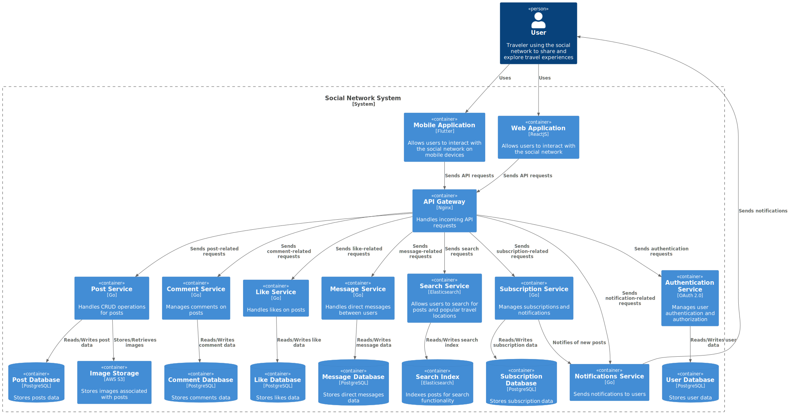
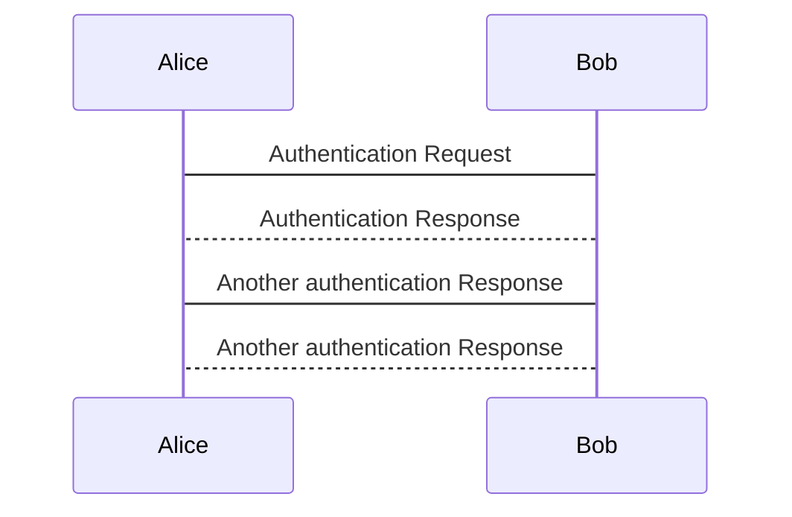

# Social network for travelers - System Design

### Functional requirements:

- публикация постов из путешествий с фотографиями, небольшим описанием и привязкой к конкретному месту путешествия;
- оценка и комментарии постов других путешественников;
- подписка на других путешественников, чтобы следить за их активностью;
- поиск популярных мест для путешествий и просмотр постов с этих мест в виде ТОПа мест по странам и городам;
- общение с другими путешественниками в личных сообщениях;
- просмотр ленты других путешественников;
- чаты только ЛС, нет групповых;
- система аутентификации (логин/разлогин/смена пароля);
- отправлять уведомления подписчикам по новым публикациям.


### Non-functional requirements:

- Количество пользователей: 10 000 000 DAU
- Доступность: availability 99,95% (5 часов может быть не доступным)
- среднее кол-во созданий постов пользователем в день - 1 пост
- среднее кол-во просмотров ленты пользователем в день - 10 раз
- сезенность есть, так как пользователи постят и просматривают места посещений перед сезоном и праздниками. В период сезонов нагрузка - в 2 раза больше обычного.
- расположение пользователей: СНГ
- данные храним всегда
- максимальное кол-во фотографий к посту - 5
- максимальный размер каждой фотографии -  500 KБ (будет применяться сжатие)
- среднее кол-во подписок у пользователя - 200 (среднее в инсте по статистике из инета). Максимально 1 млн. Среднее кол-во подписчиков у пользователя - 200. Максимально 1 млн
- latency на создание поста - 2 секунды
- latency на чтение ленты - 1 секунда
- CRUD постов;
- оценка - создать/удалить лайк;
- комментарии - создать/удалить/редактировать. Одноуровневые комментарии;
- показываем 10 постов в выдаче;
- пример объекта создания поста:
```json
  {
    "description" : "string| 2000 sym",
    "images": []object(500 KБ),
    "lon": string,
    "lat": string,
    "userID": int
  }
```


### Design overview





### Расчет нагрузки с учетом сезонности:

| **Описание**                  | **Значение**                       |
|-------------------------------|-------------------------------------|
| **RPS на создание поста**     |                                     |
| - RPS                         | (2 * 10 000 000 * 1) / 86 400 = 232 |
| - Размер запроса              | 2 550 КБ                            |
| - Traffic                     | 592 МБ/c                            |
| **RPS на чтение ленты**       |                                     |
| - RPS                         | (2 * 10 000 000 * 10) / 86 400 = 2 320    |
| - Размер ответа               | 600 КБ (в ответе отправляем ссылки на картинки) |
| - Traffic                     | 1 392 МБ/c                          |
| **Connections**               | 2 * 10 000 000 * 0.1 = 2 000 000        |


### Расчет количества дисков для хранения данных на 1 год

Посты без картинок:
- Прирост данных в год: 348 МБ/c * 86 400 * 365 = ~11 000Tb/year
- IOPS= 232 (write) + 2 320 (read) = 2 552
- Трафик = 348 МБ/с + 1 392 МБ/с = 1 740 МБ/с

Для SSD (Sata):
- Disks_for_capacity = 11 000Tb / 100Tb = 110
- Disks_for_throughput = 1 740/sec / 500Mb/sec = ~4
- Disks_for_iops = 2 552 / 1 000 = ~3
- Disks = 110

Картинки
- RPS за картинками: 232 * 2 500 КБ = 580 МБ/c
- Прирост данных в год: 580 МБ/c * 86 400 * 365 = ~18 000Tb/year
- IOPS= 232 (write) + 2 320 (read) = 2 552
- Трафик = 580 МБ/с + 5,8 ГБ/с = 6,38 ГБ/с

Для SSD (Sata):
- Disks_for_capacity = 18 000Tb / 100Tb = 180
- Disks_for_throughput = 6,38 ГБ/с / 500Mb/sec = ~13
- Disks_for_iops = 2 552 / 1 000 = ~3
- Disks = 180

## Расчет требуемого числа хостов

Для одного хоста будем использовать 2 диска.
- Hosts = disks / disks_per_host
- Hosts = 290 / 2 = 145
- Hosts_with_replication = hosts * replication_factor
- Hosts_with_replication = 145 * 2 = 290



