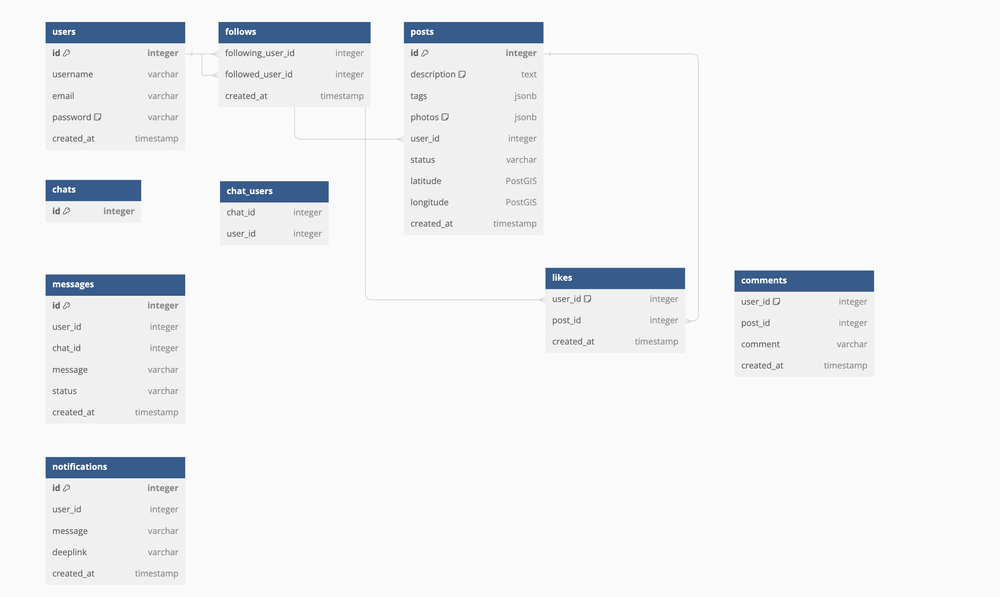

# Модель хранения данных

В качестве технологии БД для хранения всех данных (кроме статики) выбираю *PostgreSQL*. Она обладает хорошей производительностью и масштабируемостью, а также поддерживает JSON-поля, что позволит хранить сложные структуры данных в одной таблице.
Статика (изображения в моем случае) будут храниться в BLOB-хранилище (S3).

Планируется в отдельных БД хранить:
* Пользователей
* Посты
* Чаты

## Модель хранения

# Репликация и шардирование
## Репликация

Будет использоваться асинхронная репликация. Все записи будут производиться в мастер-базу, а затем асинхронно копироваться на несколько реплик. Это позволит увеличить производительность системы и обеспечить отказоустойчивость.
Можно использовать multi-master репликацию с разными ДЦ. Будет 1 мастер и 2 реплики в каждом ДЦ.

## Шардирование

- Post: шардирование по postID. Таблицы: posts, likes, comments, images.
- User: шардирование по userID. Таблицы: users, subscriptions, followers.